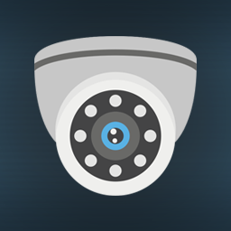

<div id='top'></div>
<br/>
<div align='center'>
    <a href='https://github.com/4c65736975/cameraSystem'>
        
    </a>
    <h3>Camera System</h3>
    <p>
        Farming Simulator 22 Modification
        <br />
        <br />
        <a href='https://github.com/4c65736975/cameraSystem/issues'>Report Bug</a>
        ·
        <a href='https://github.com/4c65736975/cameraSystem/issues'>Request Feature</a>
    </p>
</div>
<details>
    <summary>Table of Contents</summary>
    <ol>
        <li>
            <a href="#about-the-project">About The Project</a>
        </li>
        <li>
            <a href="#getting-started">Getting Started</a>
            <ul>
                <li>
                    <a href="#prerequisites">Prerequisites</a>
                </li>
                <li>
                    <a href="#installation">Installation</a>
                </li>
            </ul>
        </li>
        <li>
            <a href="#usage">Usage</a>
        </li>
        <li>
            <a href="#license">License</a>
        </li>
        <li>
            <a href="#acknowledgments">Acknowledgments</a>
        </li>
    </ol>
</details>

## About the project


This modification gives the possibility of adding cameras, e.g. a discharge pipe camera or a rear view camera. You can easily switch between added cameras which are displayed as HUD.
As standard, some of the originally available vehicles were equipped with camera configurations.
<br/>
<br />
Change camera system mode (off/always on/only when reversing) - 'y' key (default)
<br/>
Next/previous camera - 'left shift + k/m' keys (default)

ATTENTION !
- to activate the camera system, the vehicle must have their configuration added,
- the image quality of the cameras is the highest I could set, so please bear with me.

<p align="right">&#x2191 <a href="#top">back to top</a></p>

## Getting started

If you want to install latest official version, you can [download]() it like other mods.
<br/>

### Prerequisites

* [Farming Simulator 22 (PC)](https://www.farming-simulator.com/buy-now.php?platform=pc&code=DANIO)
* [Farming Simulator 22 (PC-Download)](https://www.farming-simulator.com/buy-now.php?platform=pcdigital&code=DANIO)

### Installation

1. Clone the repo
```sh
git clone https://github.com/4c65736975/cameraSystem
```
2. Open cloned folder.
3. Run modInstaller.exe.
4. That's it, if everything went as it should, you can delete cloned folder.
5. Run the game and have a nice time.

or

1. Click code, download zip.
2. Extract downloaded file.
3. Run modInstaller.exe.
4. That's it, if everything went as it should, you can delete downloaded folder and zip file.
5. Run the game and have a nice time.

<p align="right">&#x2191 <a href="#top">back to top</a></p>

## Usage


<p align="right">&#x2191 <a href="#top">back to top</a></p>

## License

Distributed under the GPL-3.0 license. See [LICENSE](https://github.com/4c65736975/cameraSystem/blob/main/LICENSE) for more information.

<p align="right">&#x2191 <a href="#top">back to top</a></p>

## Acknowledgments

* [Choose an Open Source License](https://choosealicense.com)
* [Best README Template](https://github.com/othneildrew/Best-README-Template)
* [Security camera icons created by Prosymbols Premium - Flaticon](https://www.flaticon.com/free-icons/security-camera)

<p align="right">&#x2191 <a href="#top">back to top</a></p>
